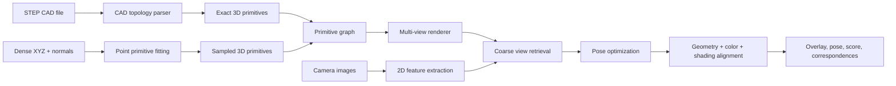

# 3D STEP/Point Cloud to 2D Camera Alignment Design

## Goal

Build a pipeline that uses the real 3D design file (`basic_shapes/s_rice.stp`) and its sampled point data (`basic_shapes/s_rice.xyz`) to extract 3D primitives, render candidate views, and precisely align CAD-derived geometry, color, and shading cues to calibrated 2D camera images in `camera_images/`.

The target output is not just the closest rendered view. The final output should estimate a camera-to-model pose per image and provide visual overlays, primitive correspondences, and confidence scores.

The core problem is an inverse rendering alignment problem:

- Geometry should explain observed edges, contours, corners, holes, and occlusion boundaries.
- CAD color/material information should explain observed surface appearance when available.
- Shading should be used as a soft cue after pose is close, because lighting and exposure can differ between rendering and the real camera.

## Current Data

- `basic_shapes/s_rice.stp`
  - Source CAD/STEP design.
  - Required for exact primitive and topology extraction.
- `basic_shapes/s_rice.xyz`
  - STEP-derived dense point and normal samples.
  - Format observed: `x y z nx ny nz`.
  - Sampling density: 1 mm is represented by about 10 points.
- `camera_images/*.jpg`
  - Six calibrated camera images, all currently 1152 x 648.
  - User description: three top-view images and three bottom-view images.
  - Current file grouping assumption:
    - `camera_front_*` -> `top`
    - `camera_back_*` -> `bottom`

## Coordinate Assumptions

These assumptions should be verified early:

- STEP and XYZ use the same model coordinate system.
- XYZ unit is millimeter or a consistent CAD unit.
- Camera images are already distortion-corrected because filenames include `calibrated`.
- Camera intrinsics are not currently present in the workspace. If no intrinsic matrix is available, the first implementation uses weak-perspective or orthographic initialization, then can upgrade to full perspective when intrinsics are added.

## Pipeline Overview



## Primitive Types

The first useful primitive set for this object should be:

- Planes
  - Large flat faces, board boundaries, rectangular blocks, mounting surfaces.
- Lines and edges
  - CAD boundary edges and projected silhouette edges.
- Cylinders/circles
  - Holes, round bosses, screw holes, circular cutouts.
- Rectangles / boxes
  - Support-frame-like components and rectangular pads.
- Optional later primitives
  - Slots, arcs, chamfers, fillets, freeform residual surfaces.

## Primitive Extraction Strategy

### From STEP

STEP is the authoritative source for exact geometry. Use OpenCascade/OCP when dependency installation is available.

Expected extraction:

- Read STEP topology.
- Traverse solids, shells, faces, wires, and edges.
- Classify surfaces:
  - plane
  - cylinder
  - cone
  - sphere
  - B-spline/freeform
- Classify curves:
  - line
  - circle
  - ellipse
  - spline
- Export a primitive JSON with CAD-space parameters.

Example primitive JSON shape:

```json
{
  "id": "face_0012",
  "type": "plane",
  "origin": [0.0, 0.0, 0.0],
  "normal": [0.0, 0.0, 1.0],
  "bounds_3d": [[-10, -5, 0], [10, -5, 0], [10, 5, 0], [-10, 5, 0]],
  "source": "step"
}
```

### From XYZ

XYZ is the fallback and cross-check source. It is also useful for robust rendering and validating the STEP extraction.

Expected extraction:

- Load points and normals.
- Downsample for fitting while preserving high-density data for refinement.
- Cluster normals to find dominant planes.
- Fit planes with RANSAC or region growing.
- Detect boundary curves from plane clusters.
- Detect cylinders/holes by local normal patterns and projected circle fitting.
- Export sampled primitive candidates with uncertainty.

## 2D Feature Extraction

For each camera image:

- Object mask
  - First version: simple contrast/edge-based object region.
  - Later: learned or manually initialized segmentation if background changes.
- Geometry features
  - Canny-like edges.
  - Line segments.
  - Contours.
  - Ellipse/circle candidates for holes.
  - Corner/keypoint candidates.
- Color features
  - Color histogram inside projected primitive regions.
  - Local normalized RGB or Lab patches.
  - Optional specular/illumination normalization.

## Alignment Stages

### Stage 1: Coarse View Retrieval

Purpose: find a reliable initial pose.

- Render primitive/point cloud candidates over yaw, pitch, roll, scale, and translation.
- Compare rendered edges/silhouette with image edges.
- Use top/bottom group priors.
- Keep top-K candidates per image.

Current baseline script:

- [scripts/match_xyz_views.py](../scripts/match_xyz_views.py)
- Writes:
  - `outputs/xyz_view_matching/best_matches.csv`
  - `outputs/xyz_view_matching/best_matches_by_group.csv`
  - `outputs/xyz_view_matching/best_overlays_contact_sheet.png`

### Stage 2: 2D Similarity Refinement

Purpose: refine image-plane alignment before full 3D pose.

Optimize:

- 2D translation
- scale
- in-plane rotation
- small out-of-plane yaw/pitch corrections

Loss:

- Chamfer distance between rendered primitive edges and camera edges.
- Silhouette IoU.
- Primitive-specific penalties:
  - projected CAD lines should align to detected 2D line segments.
  - projected circles should align to 2D ellipses/circles.

### Stage 3: Camera Pose Optimization

Purpose: estimate actual camera pose relative to CAD.

If intrinsics are available:

- Optimize `R, t` with perspective projection.
- Use PnP initialization when enough 2D-3D correspondences are known.
- Refine with differentiable or finite-difference edge/primitive loss.

If intrinsics are not available:

- Use weak-perspective pose first.
- Estimate focal length approximately or request camera calibration metadata.

### Stage 4: Geometry + Color Alignment

Purpose: use both shape and appearance.

Geometry loss:

- Edge alignment.
- Silhouette alignment.
- Primitive correspondence loss.
- Depth ordering constraints between primitives.

Color loss:

- Compare rendered primitive regions with image regions.
- Use robust color statistics per primitive rather than raw pixel equality.
- Penalize large color mismatch only after geometry is close.

Shading loss:

- Render approximate normals, visibility, and light response for each primitive.
- Compare low-frequency intensity gradients rather than exact pixel intensity.
- Estimate simple lighting per image after pose refinement:
  - ambient term
  - one or two directional lights
  - optional exposure/gamma correction
- Use shading as a soft regularizer, not as the primary alignment signal.

Recommended combined loss:

```text
L = w_edge * L_edge
  + w_silhouette * L_silhouette
  + w_primitive * L_primitive
  + w_color * L_color
  + w_shading * L_shading
  + w_pose_prior * L_pose_prior
```

Start with `w_color = 0` and `w_shading = 0`, then increase them after geometry converges.

## Outputs

For each image:

- Estimated pose:
  - yaw, pitch, roll
  - translation
  - scale or camera intrinsics-aware depth
- Best matching rendered view.
- Overlay visualization:
  - camera image
  - projected CAD edges
  - primitive IDs or selected correspondences
- Per-primitive match table:
  - primitive ID
  - 2D feature ID
  - score
  - status: matched / ambiguous / missing
- Confidence score.

## Implementation Milestones

### M0: Baseline View Search

Status: initial implementation exists.

- Load dense XYZ.
- Render multi-view point silhouette/edges.
- Match against all camera images.
- Save image-level and top/bottom group-level scores.

### M1: Better Image Geometry

- Add object mask extraction.
- Replace dense image edge matching with contour and exterior edge matching.
- Add 2D translation/scale/in-plane rotation refinement.

### M2: XYZ Primitive Extraction

- Implement plane extraction from XYZ normals.
- Implement boundary line extraction from plane clusters.
- Add circle/hole detection candidates.
- Render primitive overlays instead of only point edges.

### M3: STEP Primitive Extraction

- Add OpenCascade/OCP dependency path.
- Parse exact STEP topology.
- Export primitive JSON.
- Cross-check STEP primitives with XYZ samples.

### M4: Pose Optimization

- Add camera model.
- Support known intrinsics when provided.
- Optimize pose using primitive and edge losses.
- Produce per-image pose JSON.

### M5: Color-Aware Alignment

- Add primitive-region color sampling.
- Add robust color loss.
- Use color only after geometry alignment.

### M6: Shading-Aware Alignment

- Add normal/depth rendering from primitives or dense XYZ.
- Estimate per-image lighting after pose alignment.
- Add low-frequency shading residuals.
- Report whether shading supports or contradicts the geometry alignment.

## Immediate Next Implementation

The next code task should be M1:

- Add image object mask extraction.
- Add translation/scale refinement over the best yaw/pitch candidates.
- Save cleaner overlays where red CAD edges align against the object boundary instead of all texture edges.

This directly improves the current baseline and creates a stable foundation for primitive extraction.
